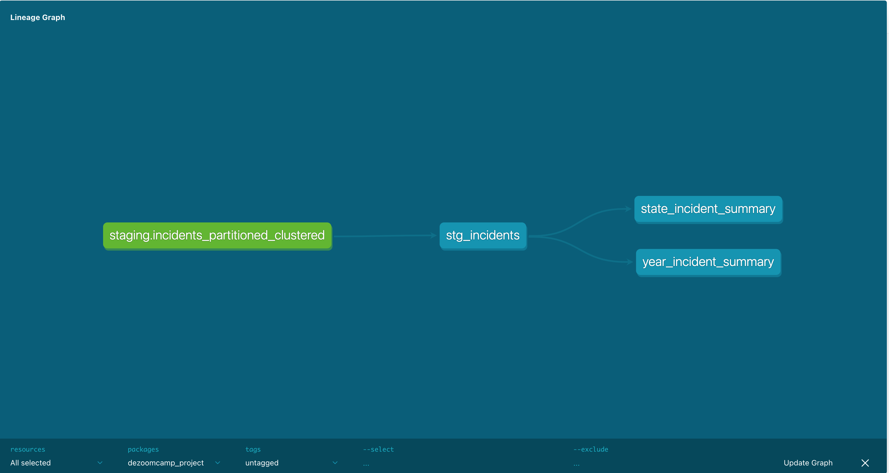

### dezoomcamp Project

This project was developed using public dataset provided by DASIL (Data Analysis & Social Enquiry Lab). The dataset used is incidents record from 2000 to 2015. However, 2010 and 2013 data were excluded for this project because of inconsistency compared to other year datasets.

The data can be downloaded [here](https://dasil.grinnell.edu/DataRepository/NIBRS/IncidentLevelSTATA.zip). The Zip file contains dta files for each year.

-----

##### Tools used

1. Airflow
2. Dbt
3. Gcp
4. Docker
5. BigQuery data warehouse
6. Data Studio

-----

##### Steps

1. Airflow was set up on GCP virtual machine

2. Airflow dag was created to download the data, unzip, convert each dta file to parquet (using pandas), published parquet files to GCS bucket and also create an external table on Bigquery data warehouse with the parquet files.

3. Table was partitioned (using incident time (year specifically)) and clustered (drug_involvement_int, state) on Bigquery

4. Data was transformed with Dbt and two seperate tables were created. One of the tables created incidents summary per year while the other created incidents summary per state

5. Data was visualized using Data Studio.

Below is the Dbt lineage graph

-----

This is the [link](https://datastudio.google.com/reporting/d40abf3d-bd3a-4320-915f-da7024c2afca) to the report dashboard.

